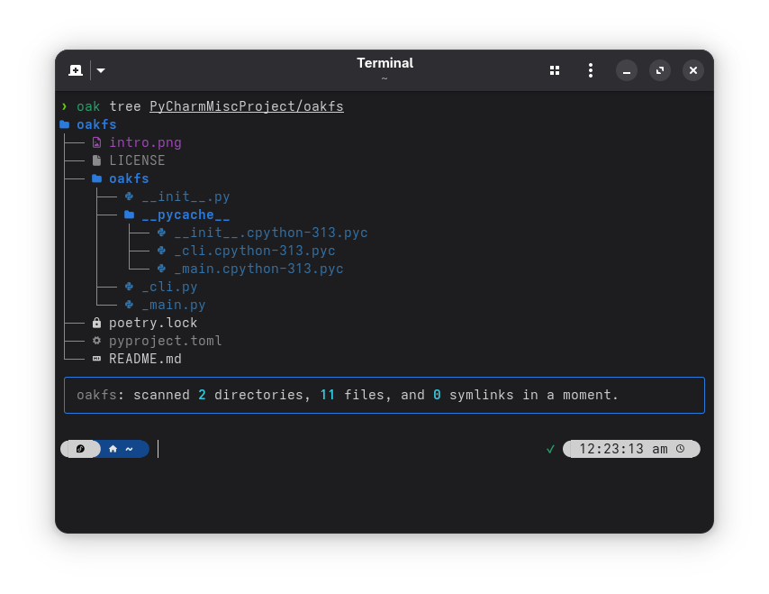
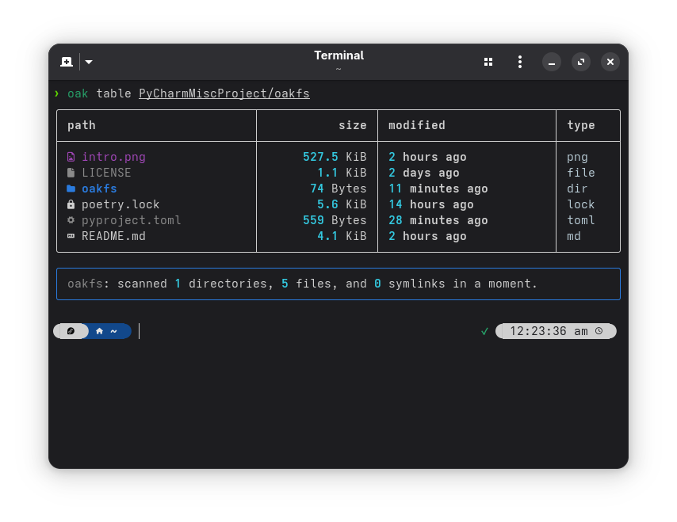

<p align="center">
  
  <br>
  <strong>oakfs</strong> is a cute filesystem visualisation tool... for cute humans 🙂.<br/>
  It provides a colorful, human-friendly way to explore your filesystem in the terminal using either a <b>tree view</b> or a <b>table view</b>.
</p>

## ✨ Features

- 🌳 **Tree view**: Visualise your filesystem hierarchy like `tree` but prettier.
- 📊 **Table view**: Display directories in a sortable table with file size, type, permissions, and modified time.
- 🎨 **Rich styling**: Icons and colors for file types (documents, images, audio, code, archives, etc.).
- 🔍 **Filtering**:
    - `--all`: include hidden files
    - `--dirs`: show only directories
    - `--files`: show only files
    - `--symlinks`: show only symlinks
    - `--junctions`: show only junctions (Windows)

- 👥 **Ownership info**: Show owner, group, and permissions with `--group`.
- 🕒 **Timestamps**: Choose between `concise` relative times (`3 minutes ago`) or `locale` formatted dates.
- 🔄 **Sorting**: Reverse order with `--reverse`.
- 🐢 **Verbose mode**: Show progress of scanning with `--verbose`.

## 📦 Installation

oakfs is available on [PyPI](https://pypi.org/project/pypi). You can install it using pip:

```bash
pip install oakfs
```

This will install `oak` as a CLI command.

## 🚀 Usage

Run `oak` from the command line:

### Tree view

```bash
oak tree [PATH]
```

Example:

```bash
oak tree ~/projects
```

### Table view

```bash
oak table [PATH]
```

Example:

```bash
oak table ~/projects
```

### No subcommand? No problem!

If you don’t specify a subcommand, `oakfs` will **prompt you** interactively to pick between `table` and `tree`.

## ⚙️ Options

Global options (apply to both commands):

| Option                              | Description                                  |
|-------------------------------------|----------------------------------------------|
| `-f, --files`                       | show files only                              |
| `-d, --dirs`                        | show directories only                        |
| `-s, --symlinks`                    | show symlinks only                           |
| `-a, --all`                         | show hidden files and directories            |
| `-g, --group`                       | show file owner, group, and permissions      |
| `-T, --dt-format [concise\|locale]` | format modified date/time (default: concise) |
| `-r, --reverse`                     | reverse sort order                           |

## 🖼️ Screenshots





## 📜 License

MIT License.  
Feel free to fork, hack, and make it cuter 💖.